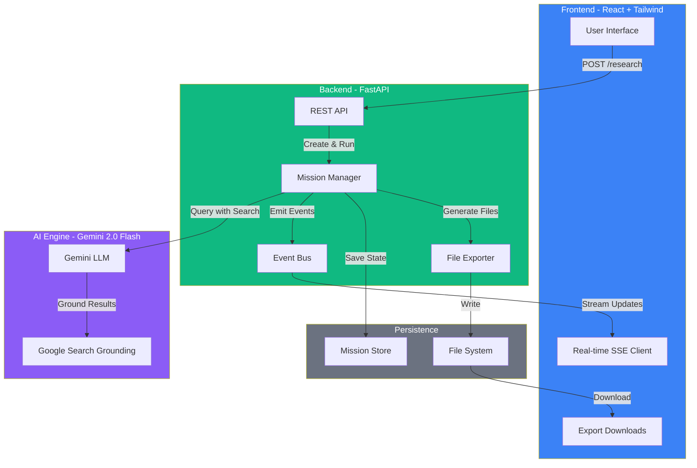
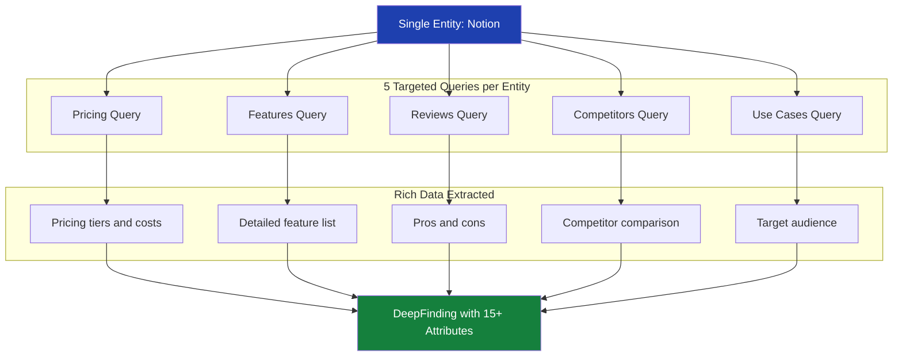
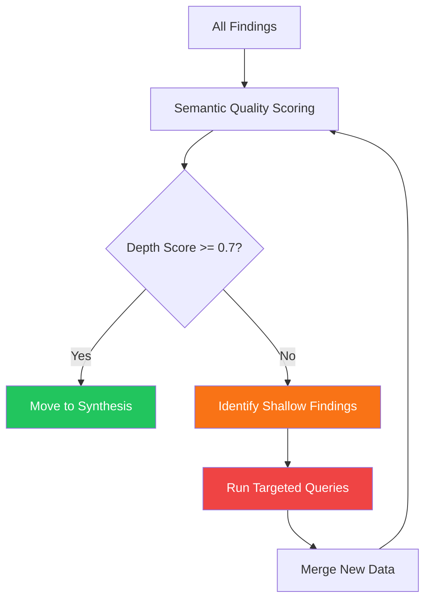
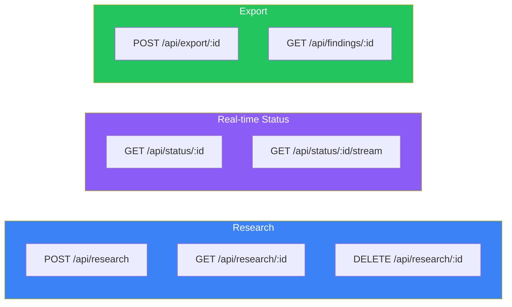
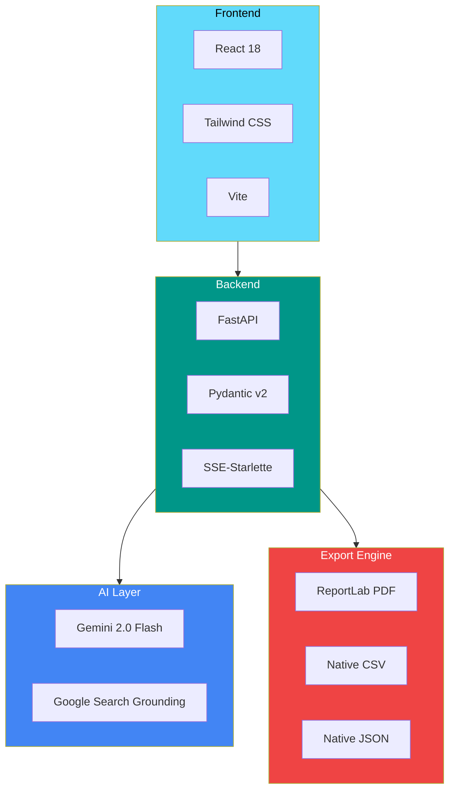
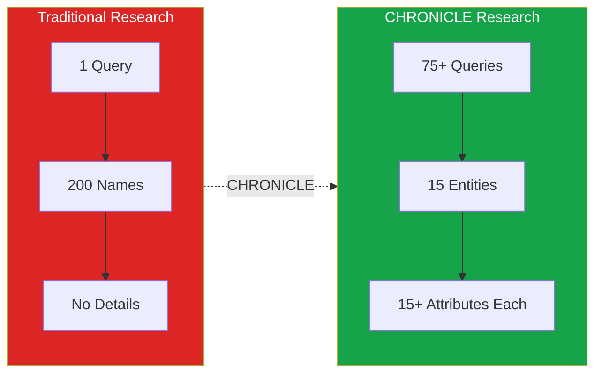
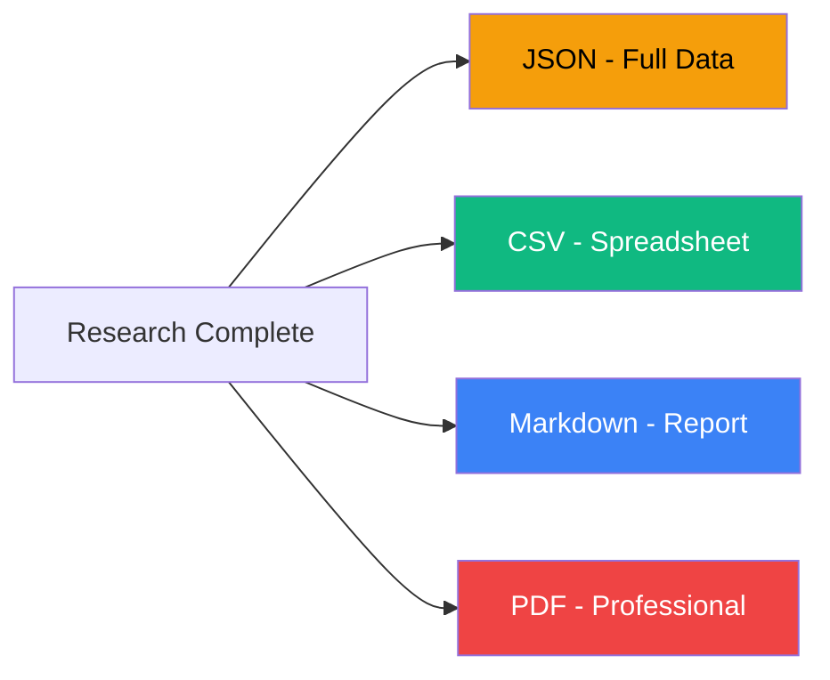

<p align="center">
  
</p>

<h1 align="center">CHRONICLE</h1>

<p align="center">
  <strong>From Question to Action: AI Research That Delivers Real Results</strong>
</p>

<p align="center">
  <a href="https://ai.google.dev/"></a>
  <a href="https://ai.google.dev/"></a>
  <a href="https://fastapi.tiangolo.com/"></a>
  <a href="https://react.dev/"></a>
</p>

<p align="center">
  
</p>

---

## The Problem

We've all been there: spending **hours** researching competitors, market trends, or potential partners—only to end up with a messy collection of browser tabs and half-finished notes.

Current AI assistants can *answer* questions, but they can't *complete* research missions.

> Ask ChatGPT "What are the best project management tools?" and you get a list of names.
>
> But what about actual pricing? Feature comparisons? Pros and cons from real users?

**CHRONICLE changes everything.**

---

## The Solution

CHRONICLE is a **Marathon Research-to-Action Agent** that transforms a single goal into comprehensive, exportable deliverables.

```
Input:  "Find the best project management tools for remote teams under $20/user"

Output: 15 deeply-researched tools with pricing, features, pros/cons,
        use cases — exported as CSV, JSON, Markdown, and PDF
```

While you grab coffee (or sleep), CHRONICLE autonomously:

| Phase | What Happens |
|-------|--------------|
| **Discovery** | Finds 20-50 candidates from multiple search angles |
| **Deep Dive** | Researches EACH entity with 5+ targeted queries |
| **Comparison** | Head-to-head entity comparisons |
| **Validation** | Verifies claims with additional sources |
| **Self-Correction** | Re-researches shallow findings automatically |
| **Export** | Generates CSV, JSON, Markdown, and PDF reports |

---

## Architecture



---

## The 8-Phase Deep Research Pipeline

This is CHRONICLE's core innovation. Instead of **1 query = 200 shallow names**, we execute **75+ targeted queries = 15 deeply-researched entities**.


### The Deep Dive Innovation

For **each entity**, we run **5 targeted queries**:



**Result:** `15 entities × 5 queries = 75+ targeted searches`

---

## Self-Correction Engine

CHRONICLE doesn't just research—it **validates quality** and **re-researches gaps**.



**Quality checks:**
- Are prices actual numbers (not "contact sales")?
- Does it have 5+ specific features?
- Are there real pros AND cons?
- Are sources cited?

---

## Quick Start

### Prerequisites
- Python 3.11+
- Node.js 18+ (for frontend)
- Gemini API Key ([Get free key](https://aistudio.google.com/apikey))

### 1. Backend Setup

```bash
cd chronicle
pip install -r requirements.txt
python run.py
```

Server runs at `http://localhost:8000`

### 2. Frontend Setup

```bash
cd chronicle/frontend
npm install
npm run dev
```

Dashboard at `http://localhost:3000`

### 3. Start Researching

1. Open `http://localhost:3000`
2. Paste your Gemini API key
3. Enter a research goal
4. Watch the magic happen in real-time

---

## API Reference



### Start a Research Mission

```bash
curl -X POST http://localhost:8000/api/research \
  -H "Content-Type: application/json" \
  -d '{
    "goal": "Find the top 10 project management tools for startups",
    "api_key": "YOUR_GEMINI_API_KEY",
    "criteria": {
      "required_fields": ["name", "description", "pricing", "features"],
      "quality_threshold": 0.7,
      "max_results": 15
    },
    "actions": {
      "export_formats": ["json", "csv", "pdf", "md"]
    }
  }'
```

### Response

```json
{
  "mission_id": "chr_abc123",
  "status": "planning",
  "stream_url": "/api/status/chr_abc123/stream",
  "message": "Mission started successfully"
}
```

---

## Tech Stack



| Layer | Technology |
|-------|------------|
| **AI Engine** | Gemini 2.0 Flash + Google Search Grounding |
| **Backend** | FastAPI, Pydantic v2, Uvicorn |
| **Frontend** | React 18, Tailwind CSS, Vite |
| **Real-time** | Server-Sent Events (SSE) |
| **Export** | ReportLab (PDF), Native CSV/JSON/Markdown |

---

## Project Structure

```
chronicle/
├── app/                    # FastAPI application entry
│   └── main.py            # CORS, routes, middleware
├── services/
│   └── mission_manager.py # 8-phase research pipeline
├── routes/
│   ├── research.py        # POST /research, GET /research/:id
│   ├── status.py          # SSE streaming, status polling
│   └── export.py          # File export endpoints
├── models/
│   ├── domain.py          # Mission, DeepFinding, ResearchPlan
│   └── requests.py        # API request/response models
├── tools/
│   └── file_export.py     # CSV, JSON, MD, PDF generation
├── persistence/
│   └── mission_store.py   # In-memory + file persistence
├── config/
│   └── settings.py        # Pydantic settings
├── frontend/              # React dashboard
│   └── src/
│       ├── App.jsx        # Main application
│       └── components/    # UI components
└── exports/               # Generated report files
```

---

## What Makes CHRONICLE Different



| Metric | ChatGPT | Traditional Research | CHRONICLE |
|--------|---------|---------------------|-----------|
| **Time** | 30 seconds | 4+ hours | 15-30 minutes |
| **Depth** | Surface-level list | Varies | 15+ attributes per entity |
| **Queries** | 1 | Manual | 75+ automated |
| **Exports** | Copy/paste | Manual formatting | CSV, JSON, PDF, Markdown |
| **Quality Control** | None | Manual review | Automated self-correction |

---

## Demo Scenarios

### Startup Research
```
Goal: "Find 10 AI startups in healthcare that raised Series A-B in 2024"

Output:
├── 10 startups with funding details, investors, descriptions
├── Comparison matrix of all startups
├── Executive summary with key insights
└── Exports: startup_research.csv, report.pdf
```

### Competitive Intelligence
```
Goal: "Research top 5 competitors in project management software"

Output:
├── Feature comparison across all competitors
├── Pricing analysis with tier breakdowns
├── Pros/cons from user reviews
└── Exports: competitive_analysis.pdf, data.json
```

### Market Analysis
```
Goal: "Identify emerging trends in sustainable packaging"

Output:
├── Key players and market leaders
├── Technology trends and innovations
├── Regulatory landscape analysis
└── Exports: market_report.pdf, findings.csv
```

---

## Export Formats



| Format | Best For |
|--------|----------|
| **JSON** | Developers, integrations, further processing |
| **CSV** | Excel/Sheets analysis, data manipulation |
| **Markdown** | Documentation, GitHub, note-taking apps |
| **PDF** | Stakeholder reports, professional sharing |

---

## Roadmap

- [x] 8-phase deep research pipeline
- [x] Real-time SSE streaming
- [x] Self-correction engine
- [x] Multi-format export (JSON, CSV, MD, PDF)
- [x] User-provided API keys
- [ ] Pause/Resume with checkpoints
- [ ] Email notifications
- [ ] Webhook integrations
- [ ] Collaborative research sessions
- [ ] Custom export templates

---

## Built With

<p align="center">
  
  
  
  
  
</p>

---

## License

MIT License - Built for the Gemini API Developer Competition

---

<p align="center">
  <strong>CHRONICLE: Research That Works While You Don't Have To</strong>
</p>

<p align="center">
  <sub>Built with Gemini 2.0 Flash + Google Search Grounding</sub>
</p>
